基于 Express 的服务器端 Web 应用，使用 ejs 模板引擎和 LayUI 构建页面

教程参考：

[2020最新最全Node实战课程（含爬虫和web服务器开发）](https://www.bilibili.com/video/BV1i7411G7kW)

#### 界面预览

后台管理端：

| 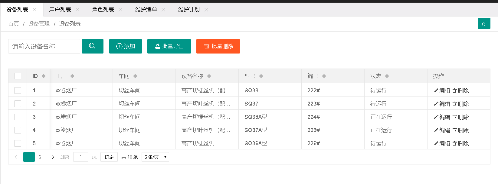         | 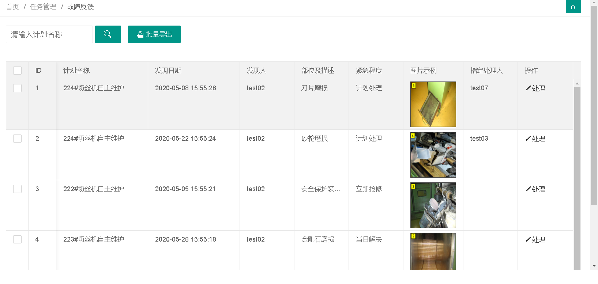       |
| --------------------------------------------- | ----------------------------------------------- |
| 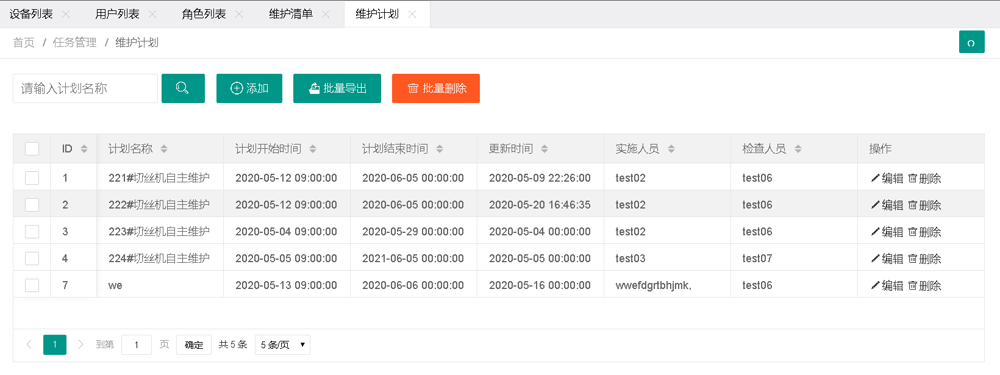 | 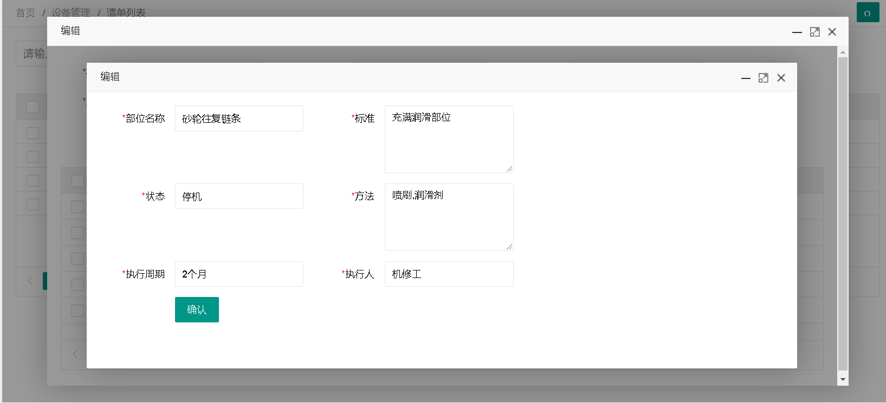 |
| 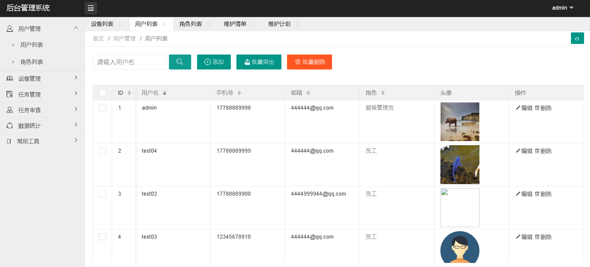 | 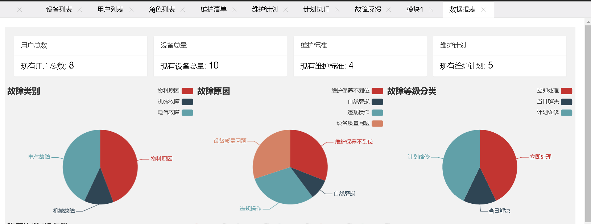   |

移动客户端：

| 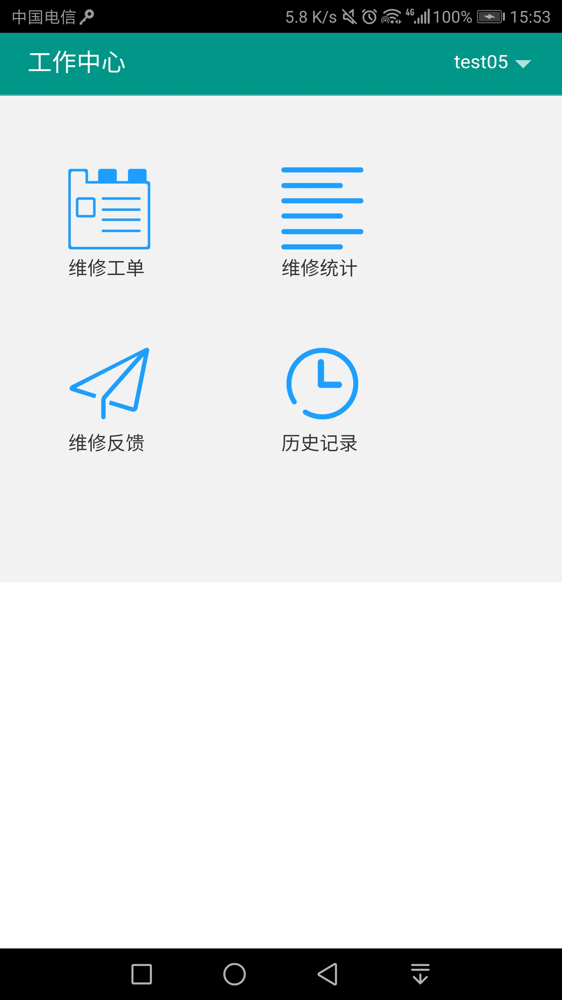 | 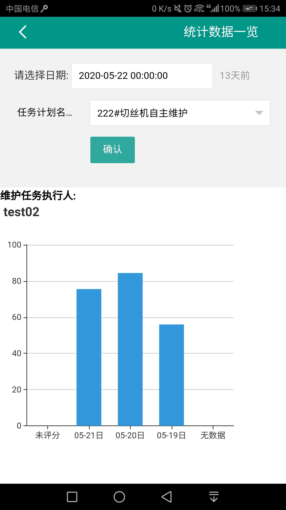     |
| --------------------------------------------------- | ------------------------------------------------- |
| 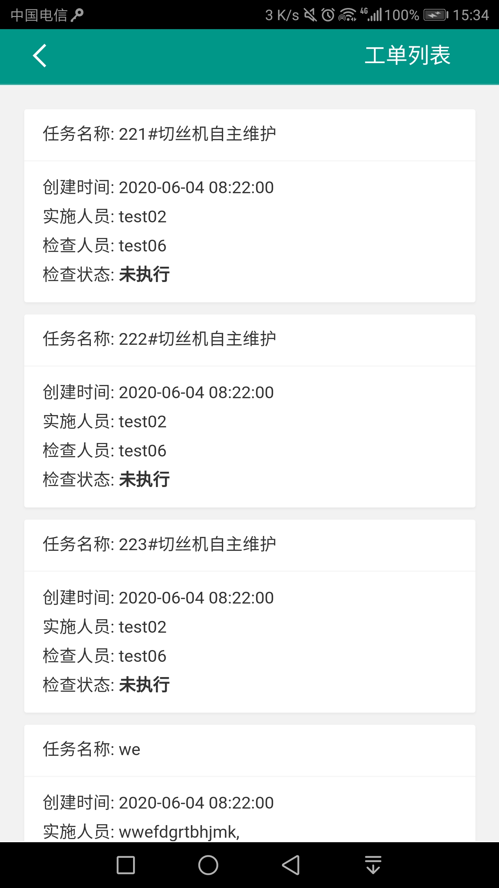   | 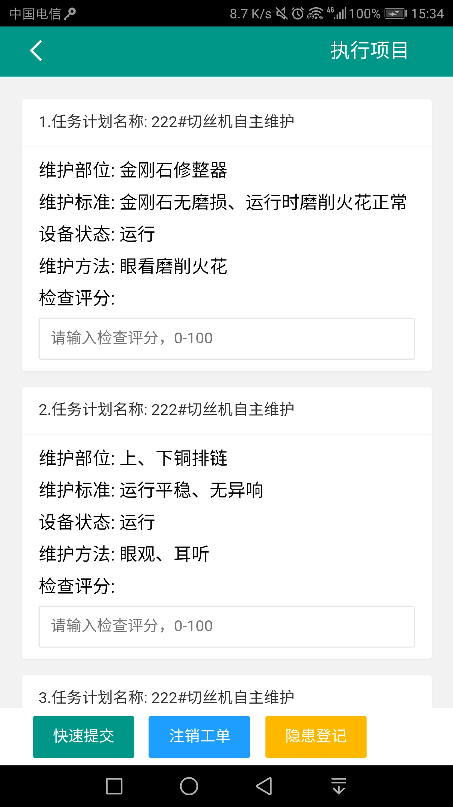 |
| 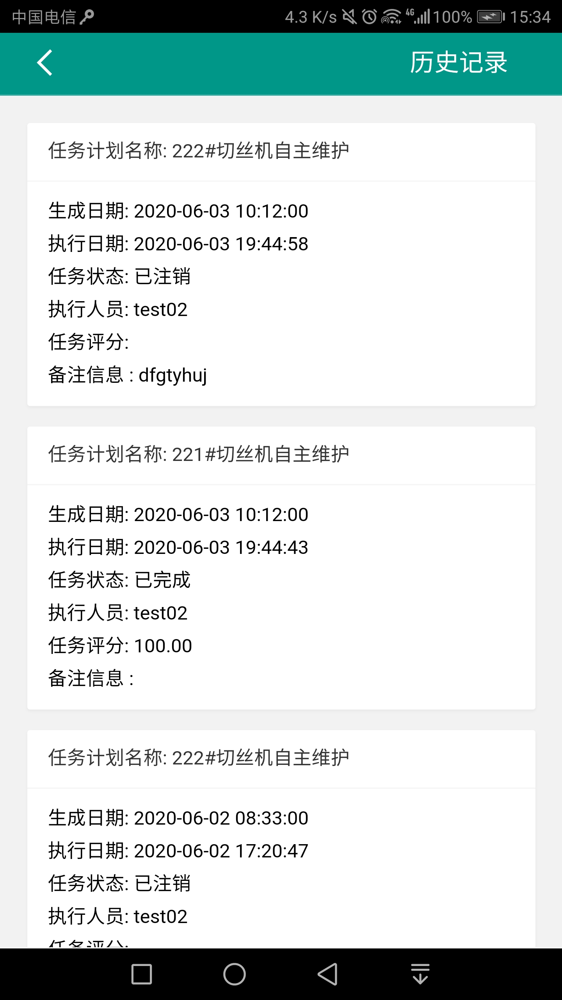       | 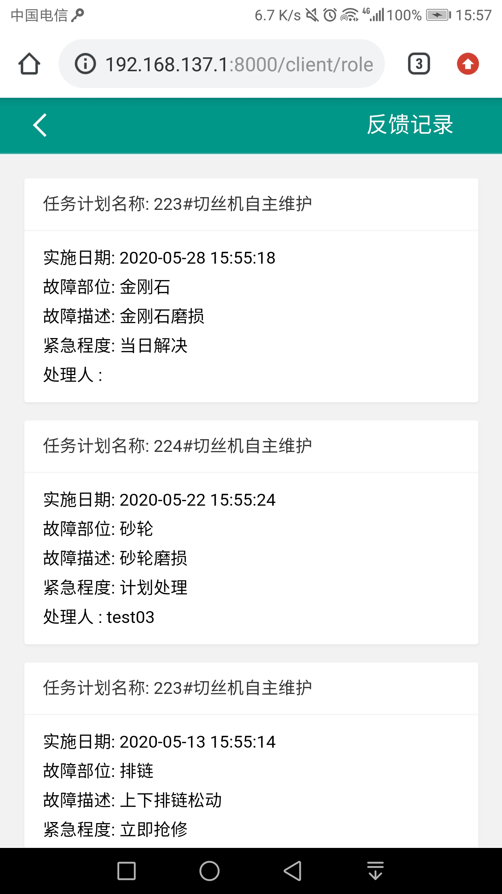     |

